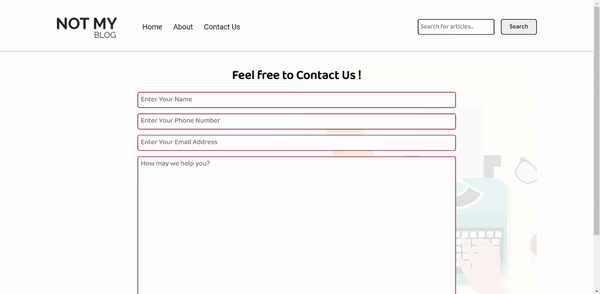
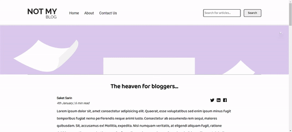

# Blog-Website-Template

It's a simple and responsive blog website template designed to use for free by anyone. The backend doesn't work totally, but you can connect it to some database and do it yourself easily. Have fun!

### Here are some live examples for demonstration: 

1. Home Page    
  

2. Search Page (Demonstration)    
  

3. Contact Page    
  

4. Blog Post Page   
 

5. Mobile View   
 
